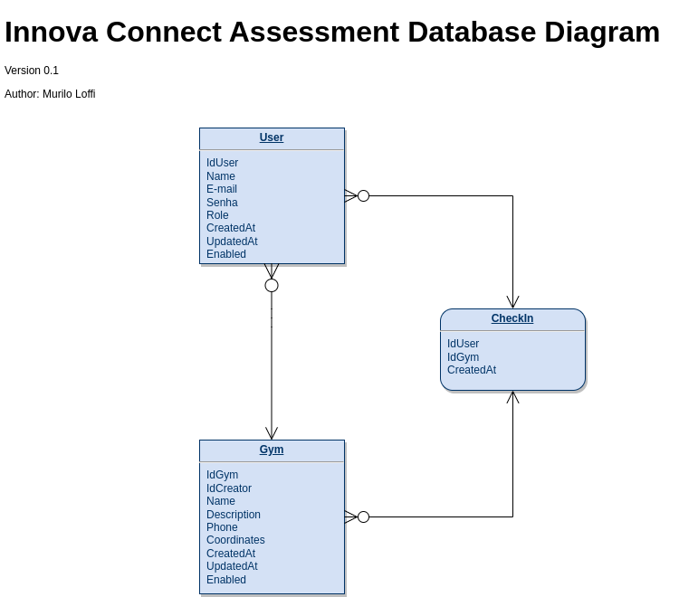

# Innova Connect Job Assessment

## What is this?
An API for an Gym checkin app.

### Requirements
* sqlite3 driver
* node18+

### Installation
Clone and run `npm install` inside the project's directory.
Run `npm run dev`. The API should be available at localhost:3000.

## Testing the API
[en] Follow the instructions in [Docs](./docs/API-TESTING.md)

[pt-br] Siga as instruções em [Docs](./docs/API-TESTING.md)

## Data structure

## Priorities board

[en] The project's requirements were broken in smaller tasks and organized in a board accessible [HERE](https://muriloloffi.notion.site/e2e345c247dc410bb080cc4d995bdc6f?v=c3c3c27ba3f34135a21479d746f65a74&pvs=4). A summary of the finished requirements from the original document can be found below as well.

[pt-br] Os requisitos do projeto foram quebrados em tarefas menores e organizadas em um quadro acessível [AQUI](https://muriloloffi.notion.site/e2e345c247dc410bb080cc4d995bdc6f?v=c3c3c27ba3f34135a21479d746f65a74&pvs=4). Um resumo dos requisitos concluídos do documento originail também pode ser encontrado abaixo.

## Requirements

### Requisitos de negócio

* <ins>Deve ser possível se cadastrar (Nome, E-mail e Senha); ✅<ins>
* <ins>Deve ser possível se autenticar (E-mail e Senha);✅<ins>
* <ins>Deve ser possível cadastrar uma academia (Nome, Descrição, Telefone, Latitude e longitude); ✅<ins>
* <ins>Deve ser possível o usuário realizar check-in em uma academia; ✅<ins>
* Deve ser possível obter o perfil de um usuário logado;
* <ins>Deve ser possível o usuário obter o seu histórico de check-ins; ✅<ins>
* Deve ser possível o usuário buscar academias pelo nome;

### RNs (Regras de negócio)

* <ins>O usuário não deve poder se cadastrar com um e-mail duplicado; ✅<ins>
* <ins>O usuário não pode fazer 2 check-ins no mesmo dia; ✅<ins>
* <ins>A academia só pode ser cadastrada por administradores; ✅<ins>

### RNFs (Requisitos não-funcionais)

* <ins>A senha do usuário precisa estar criptografada;✅<ins>
* Todas listas de dados precisam estar paginadas com 20 itens por página;
* <ins>O usuário deve ser identificado por um JWT (JSON Web Token);✅<ins>

## API architecture
[en] "Clean" MVC with a service layer between the model and the controller.

[pt-br] MVC "limpo" com uma camada de serviços entre o model e o controller.

## API data validation and sanitization
[en] To avoid the intentional storage of potentially harmful data and incorrect
data input, the methods of the express-validate package were employed for
validations and sanitizations.

[pt-br] Para evitar requisições com conteúdo potencialmente maliciosos sejam 
enviados pela API foi utilizado os métodos do pacote express-validate.